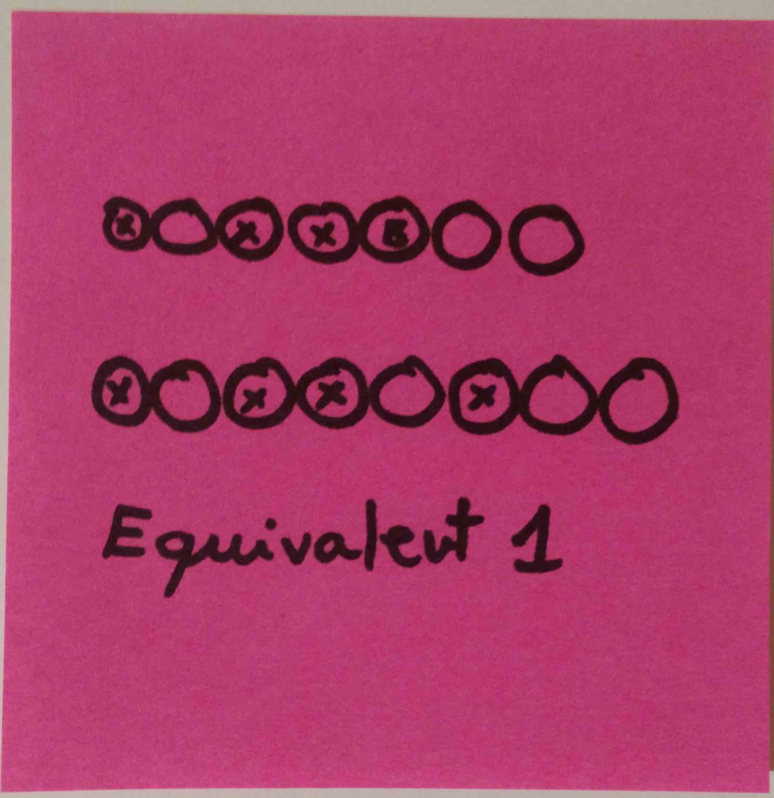

# Pool Balls kata formulation

## Description

The pool balls must be distributed in a very specific fashion, according to the rules.

The balls end up inside the triangle in a random order (depending on the previous match).

Your job is to arrange the balls in their correct order.

## Problems

### Problem 1

Calculate **the minimum number** of necessary ball swaps from the initial state to the corect one

Hint: It does not matter which swaps if there are several paths to completion

### Problem 2

Calculate **which ball swaps** are the minimum necessary set to arrange the balls. 

Suggestion: solve problem 1 first

### Problem 3 (:star:)

Calculate **which ball swaps** are the longest path from the initial state to the correct one, without repeating intermediate states (i.e., there are not loops in the states)

Example:
  
  * Assume `YRY` is the correct state
  * Assume `RYY` is the initial state
  
The solution is:
```
amount:2
swap:0,2
swap:1,2
```

Explanation:

  * From the initial state, `swap:0,1` (`RYY` -> `YRY`) solves the problem
  * From the initial state, `swap:1,2` (`RYY` -> `RYY`) is a forbidden swap because it is idempotent (i.e., introduces no change in the state)
  * From the initial state, `swap:0,2` (`RYY` -> `YYR`)
     * `swap:0,2` (`YYR` -> `RYY`) is forbidden for repeating state (introduces a loop)
     * `swap:1,2` (`YYR` -> `YRY`) solves the problem
 
Given that there are two solutions (`amount:1` and `amount:2`), we prefer the one with the biggest `amount`


## Business domain

### Representation equivalence

Theorem: A triangle of pool balls is equivalent to an array of ball representations

Proof:


Position the balls in any disposition. Here, showing the final one.



Take the balls from left to right, starting at the top then going down.


From the notation used, replace it with `Y` for yellow, `R` for red, `B` for black. Make it an array of characters


Using the previous notation, convert it from an array of characters to a String (which is an array of characters in some languages)

In this case, a `String` is enough to represent it.

### Format

The valid format is:

  * `Y` for Yellow
  * `B` for Black
  * `R` for Red

### Constraints

These are the general constraints for the problem:

  * All initial dispositions are correct in terms of balls: i.e., the order of the balls might have changed, but the amount of each ball is correct.
  * All balls with the same color are considered the identical.
  * The swap operation cannot introduce repeated states (see example above).
  * The swap operation must produce a new state, different than the old one.
  
## Input and output

Expected format:

```
amount:$AMOUNT
swap:$FROM,$TO
swap:$FROM,$TO
```

  * Given that the swap operation satisfies this property: `swap:X,Y` == `swap:Y,X`, we'll write the smaller number first. Implies: `X <= Y`
  * Given that the swap with itself (`swap:X,X`) is not a valid operation, implies: `X != Y`
  * Corollary: For every swap between `X` and `Y`, `X < Y`

Example:

```
amount:2
swap:1,2
swap:1,8
```
